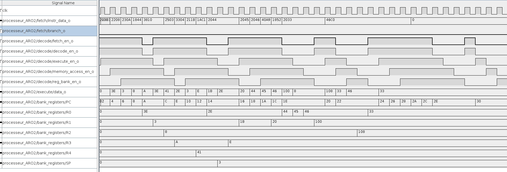
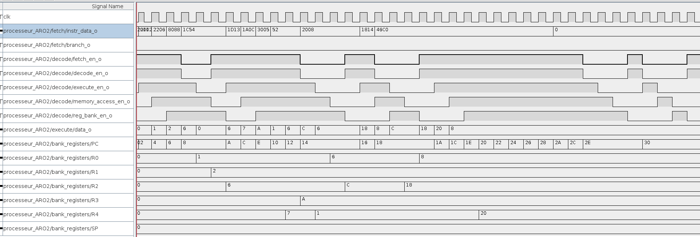

# ARO Labo5

## Questions

### 1. Comment savoir si une instruction en cours de décodage est dépendante d’une instruction qui est pour le moment dans le stage EXECUTE? dans le stage MEMORY_ACCESS? Dans le stage WRITE_BACK?
```
Il faut regarder si l'adresse du registre de destination d'il y a 3 coups de clock correspond à un registre utilisé comme source pour la commande actuelle.
Pour le MEMORY_ACCESS il faut regarder 2 étapes en arrière et pour le WRITE_BACK seulement l'étape d'avant.
```

### 2. Est-ce que cela pose un problème si une instruction en cours de décodage dépend du résultat d’une instruction qui est au stage WRITE_BACK?
```
Dans ce cas non car la propagation est instantanée dans notre simulation. Dans un cas réel ceci poserait problème car il faudrait attendre un coup de clock supplémentaire.
```

### 3. Quels informations doivent être mémorisées pour chaque instruction ?
```
- L'adresse du registre de destination.
- Si nous écrivons dans la banque de registres.
- Si nous écrivons dans la mémoire.
```

### 4. Quelles informations permettent de savoir si le registre D est utilisé ?
```
Le registre D sera utilisé si le signal reg_bank_write_en_i est à 1 pour signaler que nous allons écrire dans la banque de registre.
```

### 5. Quelles informations permettent de savoir si le registre S, N ou MEM sont utilisés ?
```
- Le registre S est utilisé si on sélectionne un "operand 1".
- Le registre N si la sélection de "operand 2" est à 0.
- Le registre MEM si on écrit dans la mémoire, c'est à dire si l'instruction en cours est un STR ou variante.
```

### 6. Une détection d’aléa de donnée va influencer quel(s) enable(s) d’étage du pipeline ? A quel moment? Pourquoi ?
```
En cas de détection d'aléa il faudra désactiver les enable des étages execute, mem_access et reg_bank pour éviter d'effectuer l'opération trop tôt. 
Il ne faut cependant pas les désactiver en même temps sinon on perdra des données en cours de calcul. Il faut plutôt les désactiver l'un après l'autre
avec l'écart d'un coup de clock à chaque fois.
Ceci permet d'effectuer un NOP fictif à la place de l'instruction qui poserait problème.
```

## Chronogrammes




### 7. Quel est l’IPC du programme (01_main.S) dans votre circuit logisim ? Pour ce calcul vous ne tiendrez pas compte des instructions NOP à la fin du programme?
```
Ceci dépend si nous comptons les ticks vide en début de programme qui correspondent à la propagation de la première instruction.
Si nous les comptons, nous obtenons un IPC de 0.64, sinon 0.73.
(25 ticks pour tout faire, 16 instructions)
```

### 8. Quel est l’IPC du programme (02_main.S) dans votre circuit logisim ? Pour ce calcul vous ne tiendrez pas compte des instructions NOP à la fin du programme?
```
Similairement, si nous comptons les ticks de début l'IPC du deuxième programme vaut 0.52 sinon il est de 0.6.
(23 ticks pour tout faire, 12 instructions)
```

### 9. Quel est le rôle des intructions NOP placées à la fin des programmes? Tester avec et sans les instructions NOP.
```
Les deux programmes sont exécutés de la même façon avec ou sans les NOP.
La seule différence et que les programmes sont considérées comme terminées beaucoup plus tôt dans le cas où il n'y a pas de NOP.
Leur utilité serait donc de retarder le début du prochain programme effectué par le processeur.
```
